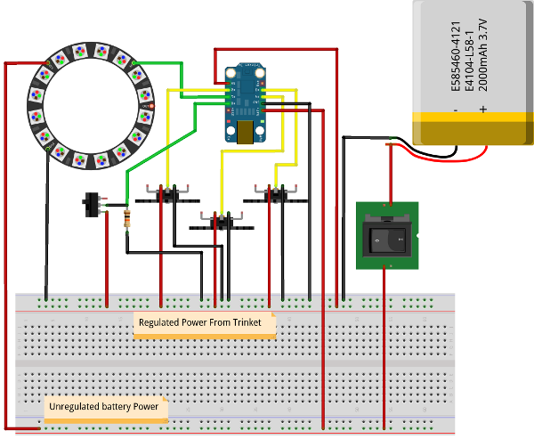

# RGB Kpop Lightstick

## Installation Guide

This Guide from Adafruits shows how to install the Arduino IDE that supports Adafruits

<https://learn.adafruit.com/introducing-trinket/setting-up-with-arduino-ide>

### Latest Arduino IDE

<http://www.arduino.cc/en/Main/Software>

### Adafruits Trinket USB Driver

<https://github.com/adafruit/Adafruit_Windows_Drivers/releases/latest>

### Uploading Code

-   Select the Tools->Programmer to be `USBtinyISP`
-   Select the Tools->Board to be `Trinket (8Mhz)` or similar from Adafruits
-   To finally upload code to the trinket select "Upload using programmer" instead of the regular upload

## Circuit Image

